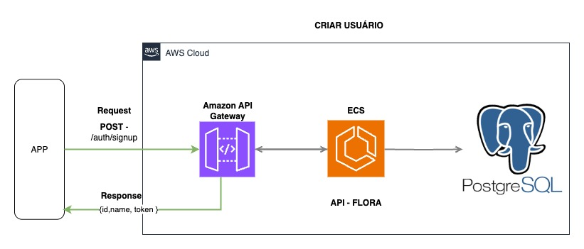
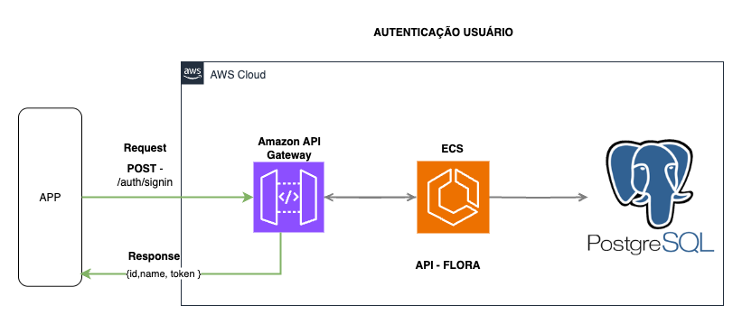
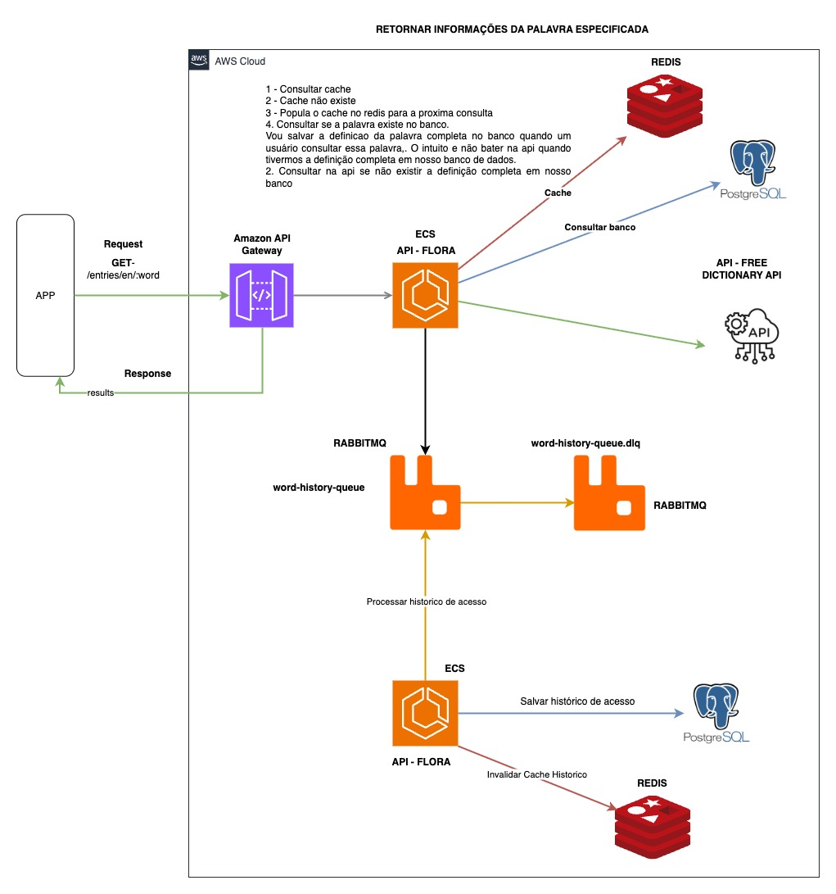
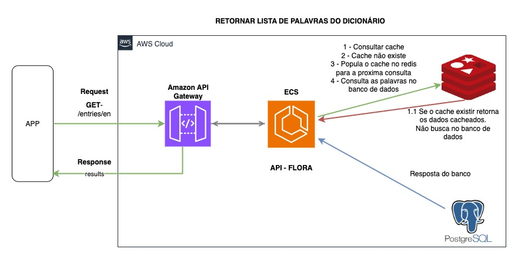
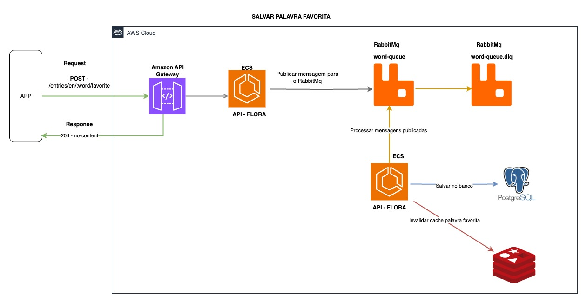
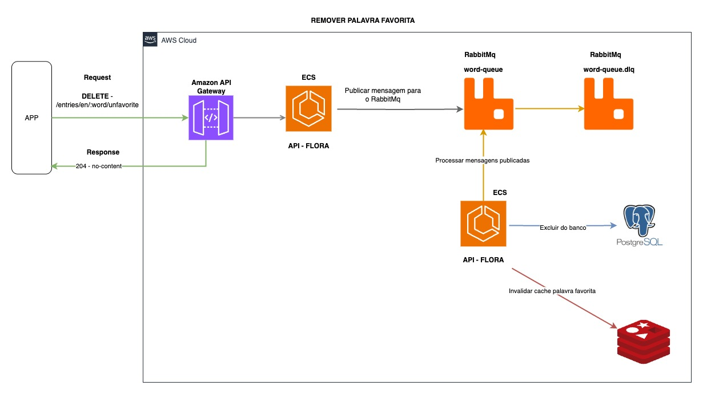
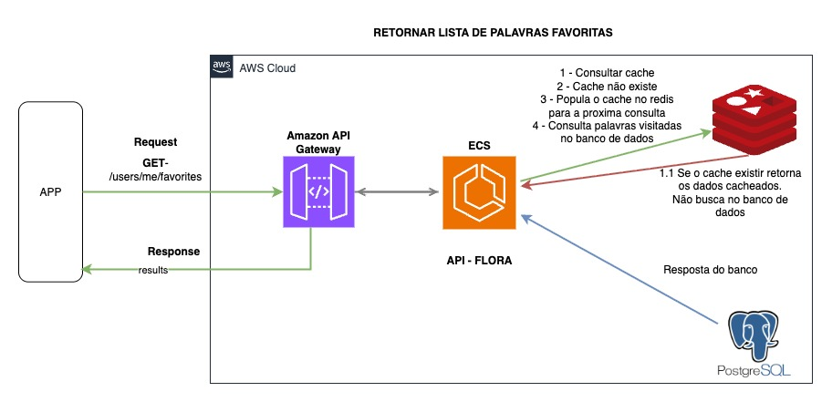
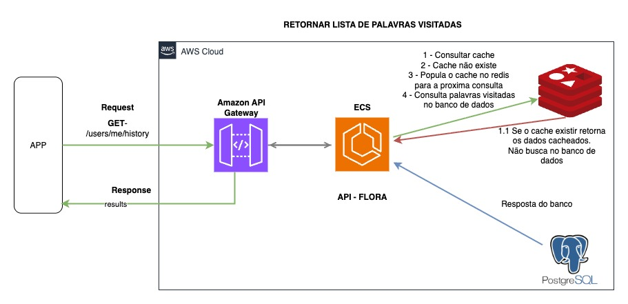
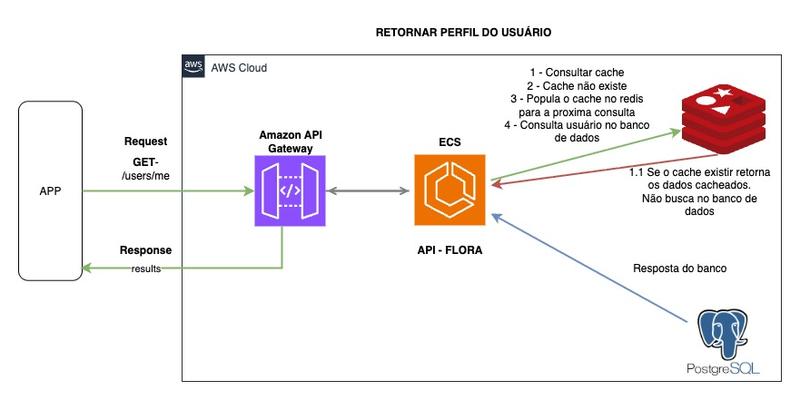

# Challenge Flora

Configurar envs locais para funcionamento do projeto arquivo .env.example raiz do projeto.

### Pré-requisitos

- **Docker**

### Instalação

1. **Clone o repositório:**

   ```bash
   git clone https://github.com/jonathanvinicius/flora
   ```


2. Execute o container da aplicação
  
   ```bash
   docker compose up -d
   ```
 Ao iniciar o container ele vai rodar as migrations, e o script que popula as palavras.

3. Importar a collection do postman disponibilizada no diretório collection

## Stack Usada

- **Backend:** Node.js, NestJS, TypeScript
- **Banco de Dados:** Postgres
- **Testes:** Jest
- **Cache:** Redis
- **ORM:** Sequelize
- **Message Broker:** RabbitMQ
- **Autenticação:** JWT

## Swagger

Para acessar o swagger da aplicação basta acessar o endpoint /docs.

## Tecnologias e Benefícios

Escolhi o NestJs como framework da API devido a diversos benefícios, tais como:

**Arquitetura modular e escalável**:
Facilita a divisão do projeto em módulos, permitindo uma manutenção mais organizada e uma escalabilidade natural conforme o sistema cresce. <br>
**Documentação automática**:
Gera documentação interativa (Swagger) de forma nativa, facilitando o desenvolvimento e a comunicação entre equipes e consumidores da API.<br>
**Injeção de dependências robusta**:
Melhora a testabilidade e a flexibilidade da aplicação.
Forte tipagem e uso de TypeScript:
Proporciona maior segurança e consistência no desenvolvimento.
## 🧪 Suporte nativo a testes

O projeto conta com integração nativa ao **Jest**, facilitando a criação e execução de testes unitários e de integração.

### Factories de dados persistidos (SQLite em memória)
Durante os testes, utilizei *factories* que criam dados reais em tempo de execução usando um banco SQLite em memória.  
Isso garante rapidez, isolamento e reprodutibilidade dos testes.

**Principais factories:**
- `createUserResponse()` – Cria um usuário fake.
- `createWordResponse()` – Cria uma palavra fake.
- `createUserFavorite()` – Cria o vínculo *usuário ↔ palavra favorita*.  
  Aceita:
  - `overrides` *(parciais de atributos para sobrescrever valores)*
  - `bulk` *(criação em lote)*
  - `quantity` *(quantidade de registros no modo bulk)*

**Exemplo de uso:**
```ts
import { createUserFavorite } from '.../user-favorite-word.factory';

it('deve criar um favorito de palavra', async () => {
  const favorite = await createUserFavorite();
  expect(favorite).toBeDefined();
});
```


## 🌐 Mensagens de erro com multilíngue
**Suporte a mensagens de erros com multilaguage**: A API suporta tradução de erros (Português e Inglês).
Basta enviar o header HTTP Accept-Language:

Accept-Language: pt → Português (padrão)

Accept-Language: en → Inglês.


## Banco de dados

**PostgreSQL**<br>
Optei pelo PostgreSQL como banco de dados relacional, que traz os seguintes benefícios:

**Confiabilidade e robustez:** <br>
Amplamente testado em produção e conhecido por sua estabilidade. <br>

**Recursos avançados:** <br>
Suporte a transações complexas, consultas avançadas e extensões que ampliam as funcionalidades do banco. <br>

**Performance e escalabilidade:** <br>
Ideal para aplicações que demandam alta performance e podem crescer em volume de dados. <br>
Ampla comunidade e suporte:
Facilita a resolução de problemas e a integração com outras tecnologias.

**Sequelize** <br>
Utilizei o Sequelize como ORM para facilitar a manipulação dos dados no PostgreSQL, oferecendo:

**Abstração do banco de dados:**<br>
Permite trabalhar com modelos e relacionamentos de forma intuitiva, reduzindo a necessidade de escrever SQL complexo.<br>
Facilidade na migração e sincronização:
Simplifica o gerenciamento das alterações na estrutura do banco de dados ao longo do tempo.


Para garantir que as APIs não fiquem expostas, optei por utilizar o JWT o, uma solução autenticação.<br>

**Segurança Aprimorada:** Garante que apenas usuários autenticados e autorizados acessem rotas protegidas.<br>

## Endpoints da API

**Autenticação e Usuários**<br>
- **POST** `/auth/signup` — Cadastro de usuário <br>

- **POST** `/auth/signin` — Autenticação de usuário<br>


**Listar Palavras**<br>

- **GET** `/` — Retornar mensagem padrão da API  
- **GET** `/entries/en/{word}` — Buscar definição de uma palavra  
  
- **GET** `/entries/en` — Retornar lista de palavras  
  
- **POST** `/entries/en/{word}/favorite` — Favoritar uma palavra  
  
- **DELETE** `/entries/en/{word}/unfavorite` — Remover uma palavra favorita  
  

**Usuários**
- **GET** `/users/me/favorites` — Buscar palavras favoritas de um usuário  
  
- **GET** `/users/me/history` — Buscar histórico de palavras pesquisadas de um usuário  
  
- **GET** `/users/me` — Retornar informações do usuário  
  

# Arquitetura Atual e Perspectiva de Evolução

Atualmente, a API possui uma **arquitetura monolítica**, onde todas as funcionalidades, de autenticação até processamento de mensagens estão acopladas em uma única base de código.  

O sistema utiliza **JWT** para autenticação, o que é positivo, porém toda a lógica de login, emissão e validação dos tokens está implementada internamente, sem uso de provedores externos.  

Além disso, a própria API é responsável por **disparar e consumir mensagens**, criando um acoplamento forte entre camadas e reduzindo a flexibilidade para evoluir ou escalar partes específicas do sistema.  

---

## Perspectiva de Evolução — Arquitetura de Microserviços
A proposta é **desacoplar a API em microserviços**, onde cada serviço será responsável por um domínio específico, utilizando seu **próprio banco de dados** e se comunicando de forma assíncrona.  

### Benefícios 
- **Escalabilidade:** Possibilidade de escalar apenas os serviços mais demandados, tanto horizontal quanto verticalmente.  
- **Resiliência:** Falhas em um serviço não comprometem o restante do sistema, pois as mensagens permanecerão na fila até serem processadas.  
- **Flexibilidade tecnológica:** Permite desenvolver cada microserviço na linguagem mais adequada, de acordo com a especialização da equipe.  
- **Segurança e controle de acesso:** Substituir a autenticação interna por **AWS Cognito**, permitindo gerenciamento centralizado de usuários, suporte a ACL (controle de acesso por permissões) e autenticação social (Google, Facebook, etc.).  


- **Divisão da base de dados:** Separar os dados por domínio para suportar escalabilidade horizontal e independência de serviços.  
- **Health check e monitoramento:** Implementar monitoramento contínuo para garantir disponibilidade, performance e detecção proativa de falhas.  
- **Integração assíncrona:** Evitar que a API seja responsável tanto por produzir quanto consumir mensagens no mesmo processo.  

<br>
